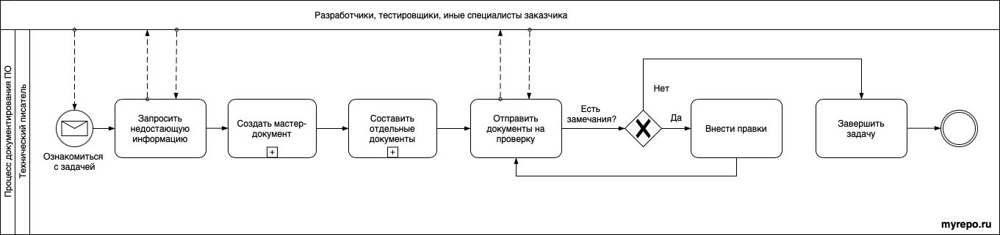

<br />
# Как я создаю техническую документацию

*Моя основная задача, как технического писателя, – создавать понятную и структурированную документацию к программным продуктам. Это весьма трудоемкий процесс, поэтому, чтобы облегчить себе жизнь, я выработал несколько правил. Поделюсь с вами личным опытом и наработками.*

---

*Схема 1. Процесс документирования ПО*


На этой схеме показан общепринятый подход к документированию программных продуктов. Расскажу о каждом этапе подробнее.

## Этап 1. Постановка задачи

Грамотная постановка задачи – это не короткая запись в таск-трекере. Это полноценное объяснение, что именно нужно сделать, в какой срок, какой результат нужно получить.

Представьте, что вам подарили картонный пазл из 500 фрагментов, а картинку не приложили. Как, спрашивается, его собрать? Не видя цельного рисунка, невозможно надеяться на успешный результат. 

Примерно так же я себя чувствую, когда приступаю к новому проекту, поскольку ничего не знаю ни о самом продукте, ни о его пользователях, ни о требованиях к документации.

Вот основные вопросы, которые я себе задаю на данном этапе (*примеры ответов под катом*):

<details>
  <summary> Что документирую? Какой программный продукт? </summary>
	- Сервис искусственного интеллекта (ИИ-сервис) по интерпретации изображений магнитно-резонансной томографии органов малого таза с внутривенным контрастированием для выявления признаков рака предстательной железы.
</details>

<details>
  <summary> Откуда беру информацию о продукте? </summary>
	- Тестовый стенд программы – [ссылка]
	- Легаси документов – [ссылка на Google Drive]
	- Комментарии в коде – [ссылка на Github-репозиторий]
	- Сотрудники:
		- Иринова Ирина, тимлид разработчиков, telegram: @i_irinova, +7(xxx)xxx-xx-xx
		- Тимофеев Тимофей, middle-разработчик, telegram: @t_timon, +7(xxx)xxx-xx-xx
</details>

<details>
  <summary> С какой целью создаю документацию? Где она будет использоваться? </summary>
	- Для регистрации программы в Минцифры (реестр отечественного ПО)
	- Документы подаются в Минцифры на бумажном носителе или в электронной форме
</details>

<details>
  <summary> Кто будет пользоваться документацией (целевая аудитория)? </summary>
	- Эксперты Минцифры при технической оценке программы на ее пригодность для регистрации
</details>

<details>
  <summary> Какие документы я должен разработать (исчерпывающий перечень)? </summary>
	1. Руководство по эксплуатации ПО
	2. Описание процессов жизненного цикла
	3. Описание функциональных характеристик ПО
	4. Образец лицензионного договора
	5. Технические условия

	\+ Заявление. Оно заполняется на портале Госуслуг, подписывается усиленной ЭЦП
</details>

<details>
  <summary> Какие требования предъявляются к документам? </summary>
	- Методические рекомендации по подаче заявлений и уведомлений – [ссылка]
	- Правила формирования и ведения единого реестра программ для ЭВМ и БД – [ссылка]
	- Требования к правообладателям и программам – [ссылка]
	- Применять ГОСТы можно, но не обязательно.
</details>

Эти вопросы я задаю руководителю, который поставил мне задачу.  
В результате у меня появляется понимание, что и как я должен делать.

## Этап 2. Сбор сведений о продукте

Чтобы упростить себе жизнь и не нарушать дедлайны, я выработал несколько правил:

1. **Пробуй сломать продукт**.  
Как правило мне дают доступ к тестовому стенду, где я могу пощупать продукт, не опасаясь его сломать. Вся прелесть в том, что даже если мне это удастся сделать, то ругать точно не будут. В худшем случае скажут спасибо, а в лучшем уделят больше времени и внимания моим вопросам.

2. **Доберись до легаси документов и комментариев в коде**.  
В контексте документации к "легаси" (англ. Legacy, наследие) относятся устаревшие документы и наработки, которые утратили свою актуальность. Из них можно почерпнуть общую концепцию продукта, подходы к его разработке и другие полезности. А комментарии разработчиков помогают найти куски кода для иллюстрации будущего текста.

3. **Задавай вопросы заранее и списком**.  
Разработчики сильно раздражаются, когда их отвлекают и задают глупые или неожиданные вопросы. Они живые люди, и им требуется время, чтобы переключиться из режима кодинга в режим общения. Поэтому, когда мне открывают "доступ к телу", я стараюсь действовать системно и экономно. 

	Во-первых, к этому моменту в моей голове уже имеется какая-то информация, которую я получил, пощупав продукт руками и прочитав легаси. Во-вторых, я готовлюсь к разговору с разработчиками, для этого предварительно высылаю им список вопросов. Вот пример моего сообщения:

```txt filename="Пример сообщения"
Николай, привет! 
  
Сергей поставил мне задачу написать руководство пользователя к ИИ-сервису. 
Этот документ нужен для регистрации программы в реестре Минцифры.
  
Есть вопросы. Нужно 30 мин твоего времени. Голосом в Discord.
  
Сегодня сможем? Во сколько?
  
Вопросы:
1. ...
2. ...
3. ...
```

## Этап 3. Сбор сведений о целевой аудитории

Как правило, вся документация пишется для трех целевых групп:

1. обычные пользователи определенного уровня подготовки;
2. разработчики, тестировщики и иные специалисты, которые поддерживают и дорабатывают продукт;
3. эксперты регулирующих органов власти, грантодатели, участники системы госзакупок.

В зависимости от выбранной целевой группы документация может сильно отличаться. Например:

- для обычных пользователей она будет подробной и наглядной, написанной простым языком; 
- для технических специалистов – краткой, использующей профессиональную терминологию и сложные примеры кода;
- для экспертов – дополненной юридическими формальностями.

## Этап 4. Составление отдельных документов


## Этап 5. Проверка документов (Docs review)

## Этап 6. Устранение замечаний

## Этап 7. Завершение задачи

