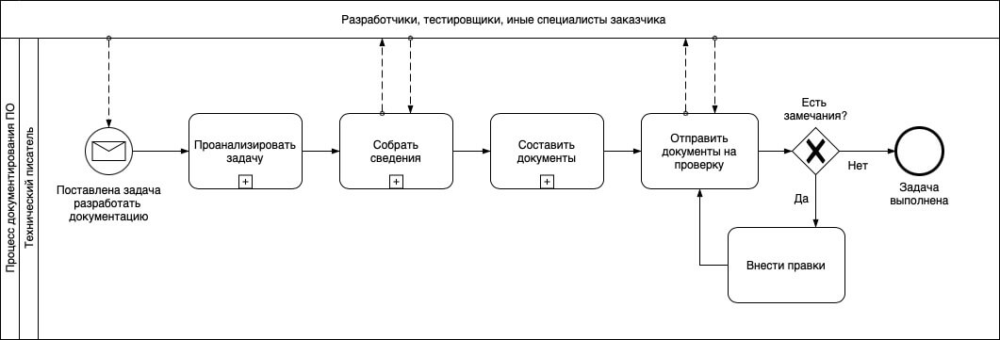
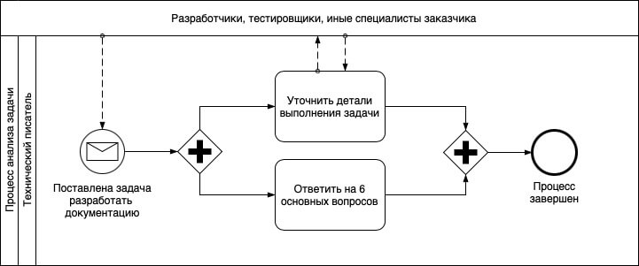
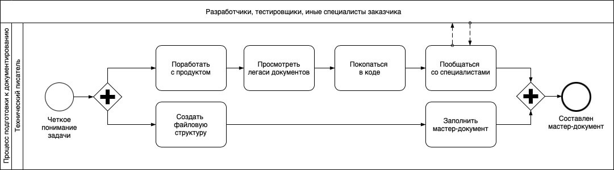

import { FileTree } from 'nextra/components'

<br />

# Как я создаю техническую документацию

*Моя основная задача, как технического писателя, – создавать понятную и структурированную документацию к программным продуктам. Это трудоемкий процесс, поэтому, чтобы облегчить себе жизнь, действую по алгоритму (см. Схему 1).*

---

*Схема 1. Процесс документирования ПО*


На схеме изобразил общепринятый подход к документированию. Применяю его. Ничего нового не изобретаю и не усложняю. Особенности кроются в деталях, поэтому расскажу о каждом этапе подробнее.

## Этап 1. Анализ задачи

Представьте, что вам подарили картонный пазл из 500 фрагментов, а картинку не приложили. Как, спрашивается, его собрать? Не видя цельного рисунка, невозможно надеяться на скорый результат. 

Примерно так же себя чувствую, когда приступаю к документированию нового продукта. Изначально я ничего не знаю ни о нем самом, ни о его пользователях, ни о требованиях к результату. Поэтому перед тем, как браться за составление документов, анализирую задачу и уточняю детали у ее постановщика.

*Схема 2. Процесс анализа задачи*


В процессе анализа формирую общее представление о предстоящих действиях: декомпозирую задачу и рассчитываю примерные сроки. Полученную информацию и свои соображения кратко конспектирую в таск-трекере. План-график прикрепляю отдельным файлом.

На данном этапе мне не важны технические характеристики и особенности продукта. Важно только общее понимание о нем, целевой аудитории и ожидаемом результате. Остальное выясняю в процессе сбора сведений и при составлении документов.

Вот мой чек-лист для этого этапа:

<details>
  <summary> Что документирую? (Какой программный продукт) </summary>
		- Сервис искусственного интеллекта (ИИ-сервис)
		- ИИ-сервис интерпретирует изображения магнитно-резонансной томографии (МРТ) органов малого таза с внутривенным контрастированием для выявления признаков рака предстательной железы.
		- Область медицины: лучевая диагностика.
		- Код по МКБ-10: С61 Злокачественное новообразование предстательной железы.
		- Общий принцип работы: 
			- ИИ-сервис встраивается в медицинскую (рентгенологическую) информационную систему.
			- Врач-ренгенолог проводит инструментальное обследование пациента. В результате в медицинском архиве изображений (PACS) сохранются снимки (формат DICOM).
			- ИИ-сервис автоматически анализирует эти снимки на предмет наличия патологии. Если патология обнаружена, ИИ выделяет "зону внимания" контурной обводкой и внутриконтурной заливкой. Формирует предварительный протокол медицинского исследования.
			- Врач-рентгенолог на своем автоматизированном рабочем месте (АРМ) отсматривает снимки и дозаполняет протокол исследования.
</details>
<details>
  <summary> Кто пользуется продуктом? В каких обстоятельствах? (Целевая аудитория продукта) </summary>
		- Врач-рентгенолог при проведении инструментального обследования пациента.
</details>
<details>
  <summary> Откуда беру информацию о продукте и его целевой аудитории? (Источники)</summary>
		- Тестовый стенд программы – [ссылка]
		- Легаси документов – [ссылка на облачное хранилище]
		- Корпоративная база знаний - [ссылка]
		- Комментарии в коде – [ссылка на репозиторий]
		- Сотрудники:
			- Фамилия Имя, тимлид разработчиков, telegram: [ссылка], +7(xxx)xxx-xx-xx
			- Фамилия Имя, middle-разработчик, telegram: [ссылка], +7(xxx)xxx-xx-xx
			- Фамилия Имя, специалист техподдержки, telegram: [ссылка], +7(xxx)xxx-xx-xx
</details>
<details>
  <summary> С какой целью создаю документацию? (Где она будет использоваться?) </summary>
		- Для регистрации программы в Минцифры (реестр отечественного ПО)
		- [Единый реестр российских программ для ЭВМ и БД. Официальный сайт реестра](https://reestr.digital.gov.ru)
</details>
<details>
  <summary> Кто будет пользоваться документацией? (Целевая аудитория документов) </summary>
		- Эксперты Минцифры при оценке программы на ее пригодность для регистрации
</details>
<details>
  <summary> Какие документы я должен разработать? (Исчерпывающий перечень) </summary>
		1. Заявление
		2. Образец лицензионного договора
		3. Описание процессов жизненного цикла
		4. Описание функциональных характеристик ПО
		5. Руководство по эксплуатации ПО
		6. Технические условия
</details>
<details>
  <summary> Какие требования предъявляются к документам? (Корпоративные и нормативные) </summary>
		- [Методические рекомендации по подаче заявлений и уведомлений. Документ pdf](https://reestr.digital.gov.ru/upload/documents/Методичка_Подача_заявления.pdf)
		- [Правила формирования и ведения единого реестра программ для ЭВМ и БД. СПС Гарант](https://base.garant.ru/71252170/)
		- [Требования к правообладателям и программам. Официальный сайт Госуслуг](https://www.gosuslugi.ru/reestrpo)
		- Применять ГОСТы можно, но не обязательно.
		- Заявление в Минцифры заполняется на портале Госуслуг, подписывается усиленной ЭЦП

		Вспомогательные материалы:
		- [Классификатор программ для ЭВМ и БД](https://base.garant.ru/74832091/)
</details>

Когда пазл сложился в цельную картину, я приступаю к детализации. Погружаюсь в технические характеристики и особенности продукта.

## Этап 2. Сбор сведений 

На предыдущем этапе я выяснил, какими источниками информации могу воспользоваться. Вот они:
- тестовый стенд программы;
- легаси документов;
- корпоративная база знаний;
- программный код и комментарии в коде;
- сотрудники компании.

Перехожу к обработке источников, начинаю общаться со специалистами. В процессе формирую мастер-документ. Это один или несколько файлов, в которых я описываю продукт. Этими описаниями я воспользуюсь на следующем этапе при составлении отдельных документов.

*Схема 3. Процесс сбора сведений*


На схеме я оразил процесс обработки источников информации и процесс обработки файлов как два параллельных процесса. Думаю, так будет проще для понимания.

### Шаг 1. Файловая структура

Прежде всего я создаю файловую структуру, с которой буду работать. Вот вариант моего локального хранилища на жестком диске компьютера. Такое же у меня в облаке на Google Drive. 

<details>
  <summary> *Примечание для тех, кто применяет Docs-As-Code* </summary>
		Если вы применяете концепцию Docs-As-Code, например, пользуетесь Github-репозиторием, то возможны отличия. Например:
		- расширение текстовых файлов скорее всего будет `.md` или `.mdx`;
		- именовать файлы лучше по-английски;
		- "тяжелые" файлы в Github-репозитории обычно не хранят. Дорого. Поэтому папки "Иллюстрации" и "Trash" лучше размещать в объектном хранилище S3 (например, в Yandex Object Storage, VK Object Storage и пр.), а "Мастер-документ" – локально или в облаке (Google Workspace, Yandex 360, VK Workspace и пр.).
</details>

*Схема 4. Пример файловой структуры*
<FileTree>
  <FileTree.Folder name="Проекты" defaultOpen>

		<FileTree.Folder name="Регистрация ИИ-сервиса в реестре отечественного ПО Минцифры" defaultOpen>
			<FileTree.Folder name="Документация" defaultOpen>
				<FileTree.File name="Заявление_в_Минцифры.docx" />
				<FileTree.File name="Образец_лицензионного_договора.docx" />
				<FileTree.File name="Описание_процессов_жизненного_цикла.docx" />
				<FileTree.File name="Описание_функциональных_характеристик.docx" />
				<FileTree.File name="Руководство_по_эксплуатации.docx" />
				<FileTree.File name="Технические_условия.docx" />
			</FileTree.Folder>
			<FileTree.Folder name="Иллюстрации" defaultOpen>
				<FileTree.Folder name="Исходники" defaultOpen>
					<FileTree.File name="img-001.jpg" />
					<FileTree.File name="img-002.jpg" />
					<FileTree.File name="img-003.png" />
					<FileTree.File name="img-124.png" />
				</FileTree.Folder>
				<FileTree.Folder name="Обработано" defaultOpen>
					<FileTree.File name="Рисунок_графического_интерфейса_001.png" />
					<FileTree.File name="Рисунок_графического_интерфейса_002.png" />
					<FileTree.File name="Схема_модели_жизненного_цикла.jpg" />
					<FileTree.File name="Схема_процесса_деперсонализации_данных.jpg" />
				</FileTree.Folder>
			</FileTree.Folder>
			<FileTree.Folder name="Мастер-документ" defaultOpen>
				<FileTree.File name="Глоссарий.docx" />
				<FileTree.File name="Мастер-документ.docx" />
			</FileTree.Folder>
			<FileTree.Folder name="Trash" defaultOpen>
				<FileTree.File name="Статья_о_моделях_жизненного_цикла.pdf" />
				<FileTree.File name="ПНСТ_Системы_ИИ_в_клинической_медицине_Часть_10.pdf" />
			</FileTree.Folder>
			<FileTree.File name="Readme.docx" />		
		</FileTree.Folder>
	</FileTree.Folder>
</FileTree>

В папке "Документация" я создаю пустые файлы документов, которые мне нужно составить. Если в моем архиве есть шаблоны таких документов, копирую их в папку.

В папку "Иллюстрации" складываю файлы с рисунками, схемами и прочими изображениями, которые планирую вставлять в документы.

В папке "Мастер-документ" находится одноименный файл "Мастер-документ.docx". Именно в этот файл я собираю все сведения о продукте. В результате он становится большой "портянкой", из которой я переиспользую куски текста при составлении отдельных документов. Когда "Мастер-документ" переваливает за 100 страниц, я его разбиваю на несколько файлов. В основном файле оставляю только оглавление с активными ссылками на дочерние файлы. "Глоссарий" предназначен для терминов и определений, чтобы соблюдать единообразие понятий.

В папке "Trash" собираю вспомогательные материалы и всякий мусор.

Файл "Readme.docx" содержит описание проекта и целевой аудитории, а также ответы на мои вопросы, которые я выяснил на предыдущем этапе. По сути, в Readme.docx дублирую описание задачи из таск-трекера. 

### Шаг 2. Мастер-документ


### Шаг 3. Целевая аудитория

Как правило, вся документация пишется для трех целевых групп:

1. обычные пользователи определенного уровня подготовки;
2. разработчики, тестировщики и иные специалисты, которые поддерживают и дорабатывают продукт;
3. эксперты регулирующих органов власти, грантодатели, участники системы госзакупок.

В зависимости от выбранной целевой группы документация может сильно отличаться. Например:

- для обычных пользователей она будет подробной и наглядной, написанной простым языком; 
- для технических специалистов – краткой, использующей профессиональную терминологию и сложные примеры кода;
- для экспертов – дополненной юридическими формальностями.

Раньше я писал документ "для всех" без учета целевой аудитории, и получалось, что "ни для кого". Теперь я создаю портреты пользователей. Например:

```txt filename="Портрет пользователя"
Ольга, 38 лет, менеджер по продажам:
- Использует программу раз в месяц.
- Боится что-то сломать.
- Ищет кнопку "Сделать все правильно".
```

```txt filename="Портрет пользователя"
Олег, 27 лет, системный администратор
- Опыт работы: 5 лет в IT-сфере
- Технические навыки: middle+
- Потребности:
	- Не любит "воды" в документации
	- Интересуется новыми технологиями
	- Пользуется программой для рабочих задач
```

Когда я работаю над документом эти портреты находятся у меня перед глазами. Они помогают не сбиваться со стиля повествования. Сами понимаете, что для Ольги и Олега требуется разные документы как по содержанию, так и по манере изложения.

### Шаг 4. Сведения о продукте

Чтобы упростить себе жизнь и не нарушать дедлайны, я выработал несколько правил:

1. **Пробуй сломать продукт**.  
Как правило, мне дают доступ к тестовому стенду, где я могу пощупать продукт руками, не опасаясь его сломать. Вся прелесть в том, что даже если мне это удастся сделать, то ругать точно не будут. В худшем случае скажут спасибо, а в лучшем уделят больше времени и внимания моим вопросам.

2. **Доберись до легаси документов и комментариев в коде**.  
В контексте документации к "легаси" (англ. legacy, наследие) относятся устаревшие документы и наработки, которые утратили свою актуальность. Из них можно почерпнуть общую концепцию продукта, подходы к его разработке и другие полезности. А комментарии разработчиков помогают найти куски кода для иллюстрации будущего текста.

3. **Задавай вопросы заранее единым списком**.  
Разработчики сильно раздражаются, когда их отвлекают глупыми или неожиданными вопросами. Они живые люди, и им требуется время, чтобы переключиться из режима кодинга в режим общения. Поэтому, когда мне открывают "доступ к телу", я стараюсь действовать аккуратно. 

Во-первых, к этому моменту в моей голове уже имеется какая-то информация, которую я получил, пощупав продукт руками и прочитав легаси. Во-вторых, я готовлюсь к разговору с разработчиками, для этого предварительно высылаю им список вопросов. Вот пример моего сообщения:

```txt filename="Пример сообщения"
Николай, привет! 
  
Сергей поставил мне задачу написать руководство пользователя к ИИ-сервису. 
Этот документ нужен для регистрации программы в реестре Минцифры.
  
Есть вопросы. Нужно 30 мин твоего времени. Голосом в Discord.
  
Сегодня сможем? Во сколько?
  
Вопросы:
1. ...
2. ...
3. ...
```

## Этап 4. Составление документов

На этом этапе я приступаю к непосредственному написанию документации.


## Этап 5. Проверка документов (Docs review)

## Этап 6. Устранение замечаний

## Этап 7. Завершение задачи


Создание качественной технической документации - это комплексный процесс, требующий внимания к деталям и постоянного совершенствования навыков. Важно помнить, что хорошая документация помогает не только пользователям, но и всей команде разработки, упрощая процесс внедрения и поддержки продукта.

Надеюсь, мой опыт поможет вам в создании эффективной технической документации. Но не забывайте, что каждый проект уникален, и подход к документированию может и должен адаптироваться под конкретные обстоятельства.