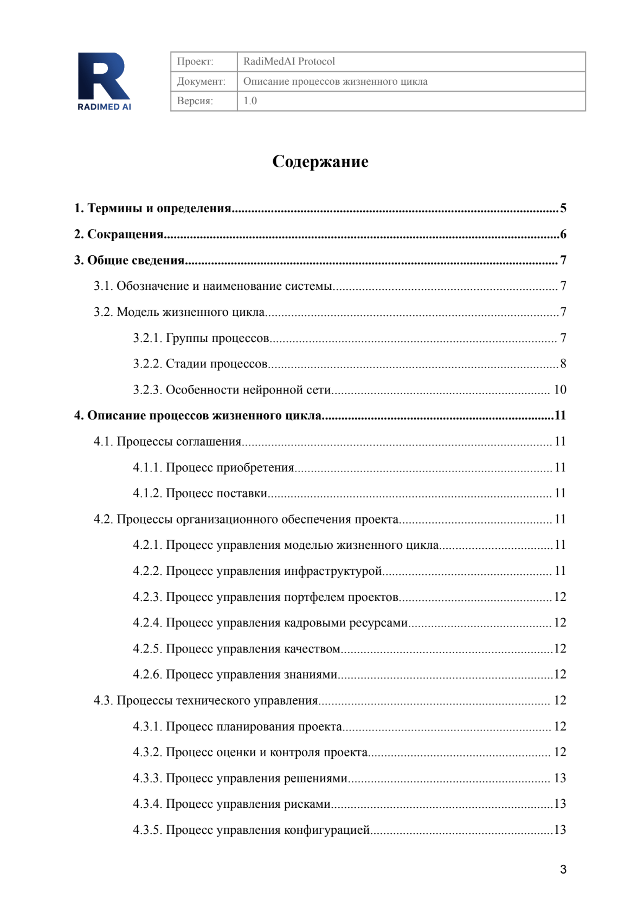

# Примеры документов

## Описание программы

[Ссылка на документ](https://drive.google.com/file/d/16OCnFD6tYP3QDlVScs__JUQhpsILeLZO/view?usp=share_link)  
*Открывается в pdf на Google Drive.*  

	

	

	

## Описание процессов жизненного цикла

[Ссылка на документ](https://drive.google.com/file/d/1Yv3s0gPDHekN2_OKb9_uxEgpz9ihEHIs/view?usp=sharing)  
*Открывается в pdf на Google Drive.*  

	

	

	

## Ведомость эксплуатационных документов

[Ссылка на документ](https://drive.google.com/file/d/1twqfreyo5l2q_VVE6RVsSiFhCdx9RULh/view?usp=sharing)  
*Открывается в pdf на Google Drive.*  

	

	

	

## Протокол валидации

[Ссылка на документ](https://drive.google.com/file/d/1sjZrKdc1PT-WDwxrhp8rWChtETTFNMDX/view?usp=sharing)  
*Открывается в pdf на Google Drive.*  

	

	

	

## Журнал версий программы

[Ссылка на документ](https://drive.google.com/file/d/1TQ-lL82ISj4GEHU_Sa_5x9wCN1HYSXhM/view?usp=sharing)  
*Открывается в pdf на Google Drive.*  

	

	

## Дорожная карта конкурса

[Ссылка на документ](https://drive.google.com/file/d/16QpAkJR25ulz-IeC2Zc9fkreWypIFWi6/view?usp=sharing)  
*Открывается в pdf на Google Drive.*  

	

	

	

