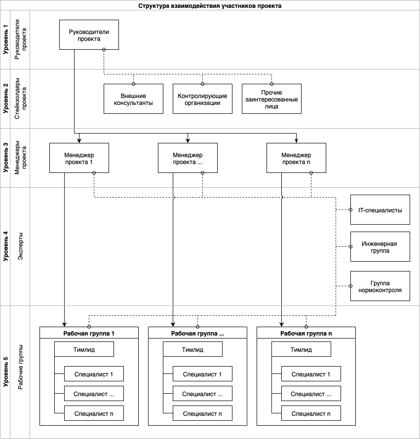

 

# Примеры схем

*Примеры схем бизнес-процессов, отрисованных мной для иллюстрации текстов и документов. При необходимости применяю [нотацию BPMN 2.0](/knowledge-base/concepts/bpmn.mdx). Пользуюсь онлайн-сервисом [Draw.io](https://www.drawio.com) и программой [OmniGraffle](https://www.omnigroup.com).*

---

Схема 1. Процесс документирования программного обеспечения

Схема 2. Процесс анализа задачи

Схема 3. Процесс сбора сведений

Схема 4. Процесс разработки и согласования документов
