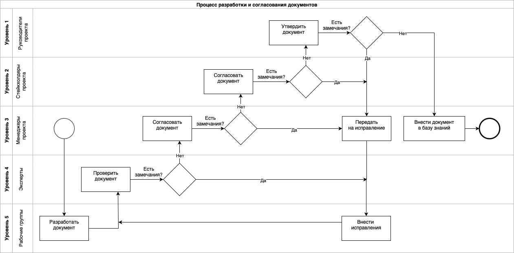

# Описание проекта

*В 2024-2025 годах мне довелось участвовать в проектировании комплексной информационной системы для медицинского центра. Проект реализовывался в рамках 223-ФЗ. К исполнению привлекались инженеры, разработчики, технические писатели, нормоконтролеры и другие специалисты.*

## Цель проекта

Разработать проектную и рабочую документацию на комплексную информационную систему медицинского центра.

## Сроки выполнения

| Номер | Наименование работ | Дата начала | Дата окончания |
| --- | --- | --- | --- |
| 1 | Работы 1 этапа «Технический проект» | 01.05.2024 | 31.12.2024 |
| 2 | Работы 2 этапа «Рабочая документация» | 01.01.2025 | 31.08.2025 |

## Организация работы

**Команда проекта:** 35+ человек.

*Схема 1. Структура взаимодействия участников проекта*

## Маршрутизация документов

Разрабатываемые документы проходили сложную маршрутизацию:

- создавались и дорабатывались рабочими группами,
- передавались на экспертную проверку и нормоконтроль, 
- обсуждались заинтересованными участниками, 
- корректировались и выносились на утверждение.

*Схема 2. Процесс разработки и согласования документов*

## Рабочие задачи

Рабочие группы работали спринтами по Scrum. Основной подход – декомпозировать комплексные задачи на более простые и управляемые. Вот примеры "простых" задач. Больше всего времени уходило на сбор данных.

  
 Написать два пункта про обучение персонала и устранение неисправностей системы 

	**2.5. Обучение и квалификация персонала**

	2.5.1. Квалификация персонала, участвующего в поддержании процессов жизненного цикла программного обеспечения, должна соответствовать требованиям профессиональных стандартов. Перечень профстандартов указан в Таблице 2.
	
	Таблица 2. Перечень профстандартов  
	| № п/п | Профессиональный стандарт |
	| ------ | ------ |
	| 1. | Программист, утв. Приказом Минтруда России от 20.07.2022 № 424н |
	| 2. | Системный программист, утв. Приказом Минтруда России от 29.09.2020 № 678н |
	| 3. | Специалист по тестированию в области информационных технологий, утв. Приказом Минтруда России от 02.08.2021 № 531н |
	| 4. | Специалист по технической поддержке информационно-коммуникационных систем, утв. Приказом Минтруда России от 29.09.2020 № 675н |
	| 5. | Технический писатель (специалист по технической документации в области информационных технологий), утв. Приказом Минтруда России от 03.10.2022 № 609н |
	
	2.5.2. Квалификация персонала подтверждается документами об образовании и (или) опытом работы по профилю деятельности. Допускается выполнение одним лицом функций, предусмотренных разными профессиональными областями деятельности, на условиях совместительства.

	2.5.3. Обязательные требования к получению персоналом дополнительного профессионального образования не предъявляются. Рекомендуется периодическое (каждые пять лет) обучение персонала на учебных курсах по профилю деятельности с целью повышения квалификации.

	2.5.4. Для поддержания профессиональных компетенций на конкурентноспособном уровне персоналу рекомендуется следить за изменениями, происходящими в профессиональной области деятельности, изучать новые методы и технологии, участвовать в публичных мероприятиях, проводимых профессиональным сообществом, уметь реализовать доступные новшества в программном продукте для улучшения его технических характеристик по измеримым показателям.

  **2.6. Устранение неисправностей**

	2.6.1. Обязанность по устранению неисправностей программного обеспечения, включая оперативное реагирование на устранение сбойных ситуаций, возлагается на изготовителя. 
	
	2.6.2. При выявлении ошибок функционирования программного обеспечения пользователь должен незамедлительно сообщить об этом изготовителю любым доступным способом связи:
	
	По номеру телефона: +7(ххх)xxx-xx-xx  
	По адресу электронной почты: xxx@xxxxxx
	
	2.6.3. Программное обеспечение распространяется по договору простой (неисключительной) лицензии. Изменения программного кода, поддержание работоспособности системы и ее частей осуществляется персоналом изготовителя. 
	
	2.6.4. Несанкционированное вмешательство пользователя в программный код и алгоритмы работы программного обеспечения воспрещается. В случае возникновения потребности в изменении программного обеспечения пользовать может связаться с изготовителем и запросить адаптировать программный продукт под необходимую задачу.

  
 Написать компонентный состав функциональных подсистем 

  **КОМПОНЕНТНЫЙ СОСТАВ ФУНКЦИОНАЛЬНЫХ ПОДСИСТЕМ**

	Функциональные подсистемы должны включать следующие технологические компоненты:

	* ИТ-инфраструктура базового уровня
	* Медицинская информационная система (МИС) для обеспечения клинического функционала
	* Административная информационная система для управления бизнес-процессами
	* Система поддержки принятия врачебных решений на основе технологий искусственного интеллекта
	* Научно-исследовательские подсистемы
	* Интеграционный сервис
	* Системы диспетчеризации инженерных комплексов "Умного дома"
	* Подсистемы информационной безопасности

	**СПЕЦИФИКАЦИЯ БАЗОВЫХ СЕРВИСОВ**

	Базовый технологический стек должен содержать следующие компоненты:

	* Средства виртуализации программного обеспечения
	* Серверные и хостовые операционные системы
	* Офисный пакет и вспомогательное ПО
	* Корпоративная почтовая система
	* Файловое хранилище данных
	* Веб-портал клиники с поддержкой внешнего доступа
	* Служба каталогов единого доступа
	* Система видео-конференц-связи

	**СПЕЦИФИКАЦИЯ МЕДИЦИНСКОЙ ИНФОРМАЦИОННОЙ СИСТЕМЫ**

	МИС-инфраструктура должна включать:

	* Медицинскую информационную систему с модулями:
		* Регистрационное ПО
		* Операционный блок
		* Госпитализационное управление
		* Реабилитационный модуль
		* Документооборот
		* Система назначений

	* Интеграционное ПО для взаимодействия с ЕГИСЗ
	* Телемедицинское решение
	* Личный кабинет пользователя
	* ЛИС-интегратор (лабораторная информационная система)
	* РИС-интегратор (радиологическая информационная система)
	* Интерфейс для работы с высокотехнологичным медицинским оборудованием

	**СПЕЦИФИКАЦИЯ АДМИНИСТРАТИВНОЙ ИНФОРМАЦИОННОЙ СИСТЕМЫ**

	Административный технологический стек должен включать:

	* HR-система с модулем НМО
	* Логистическое ПО
	* Бухгалтерская система
	* Бюджетирование
	* CRM-система
	* Маркетинговое ПО
	* Инвентаризационное решение
	* Система закупок с поддержкой КТРУ
	* Складское ПО
	* Корпоративный портал

	**СПЕЦИФИКАЦИЯ ИНТЕЛЛЕКТУАЛЬНЫХ СЕРВИСОВ**

	ИИ-компоненты должны обеспечивать:
	* Анализ временных рядов (ЭКГ, ЭЭГ)
	* Обработку медицинских изображений в формате DICOM (КТ, МРТ)
	* Анализ неструктурированных медицинских данных

	**СПЕЦИФИКАЦИЯ НАУЧНО-ИССЛЕДОВАТЕЛЬСКОГО ФУНКЦИОНАЛА**

	Научно-исследовательские подсистемы должны обеспечивать:
	* Клинические исследования
	* Клинические апробации

	**СПЕЦИФИКАЦИЯ ИНТЕГРАЦИОННОГО СЕРВИСА**

	Интеграционная платформа должна обеспечивать:
	* Межсистемную интеграцию внутри ИТ-инфраструктуры
	* Взаимодействие с внешними системами:
		* ДМС
		* ОМС
		* ПМУ
		* Фонды
		* ЕГИСЗ (включая ВИМИС, ФРНСИ, РЭМД, ИЭМК)

  
 Написать требования к составу и параметрам аппаратных средств 

  **ТРЕБОВАНИЯ К СОСТАВУ И ПАРАМЕТРАМ АППАРАТНЫХ СРЕДСТВ**

	**Центральный процессор:**
	* Количество ядер: не менее 32
	* Тактовая частота на одно ядро: не менее 1600 МГц
	* Поддержка AVX 2.0

	**Оперативная память (ОЗУ):**
	* Объем: не менее 64 Гб
	* Тактовая частота: не менее 2666 МГц

	**Постоянное запоминающее устройство (ПЗУ):**
	* Количество физических носителей: не менее 2 шт.
	* Объем на один носитель:
		* SSD: не менее 256 Гб
		* HDD: не менее 500 Гб

	**Сетевой адаптер (контроллер):**
	* Пропускная способность: не ниже 100 Мбит/с

	**Графический процессор:**
	* Nvidia TESLA T4
	* или процессор серии RTX или старше с 16 Gb ОЗУ

	**ПРОГРАММНОЕ ОБЕСПЕЧЕНИЕ**

	**Системные требования:**
	* Операционная система: Ubuntu Server 64 bit версии не ниже 18.04 LTS
	* Python версии не ниже 3.7
	* MongoDB версии не ниже 4.0
	* RabbitMQ версии не ниже 3.12.2
	* Tensorflow/Serving версии не ниже 2.12

	**Дополнительные требования:**
	* Доступ к сети Интернет
	* Возможность обмена информацией через Интернет
	* ПО не требует физических носителей
	* Необходимость подключения к системе PACS
	* Поддержка протоколов: DICOM, TCP/IP

	**МИНИМАЛЬНЫЕ ТЕХНИЧЕСКИЕ ХАРАКТЕРИСТИКИ АРМ**

	**Windows**
	* **ОС:** Windows 10
	* **Процессор:** Core i5 2-го поколения (2 ГГц)
	* **Оперативная память:** 4 Гбайт
	* **Свободное место:** 20 Гбайт
	* **Браузеры:**
		* Firefox версии 45
		* Chrome версии 50
		* Opera версии 37
		* Yandex Browser 16.3

	**Linux**
	* **ОС:** Debian, Ubuntu и их производные
	* **Процессор:** Core i5 2-го поколения (2 ГГц)
	* **Оперативная память:** 8 Гбайт
	* **Свободное место:** 25 Гбайт
	* **Браузеры:**
		* Firefox версии 45
		* Chrome версии 50
		* Opera версии 37
		* Yandex Browser 16.3

	**Mac OS**
	* **ОС:** OS X El Capitan 10.11.6
	* **Процессор:** Intel 2.66 ГГц Core 2 Duo C
	* **Оперативная память:** 2 Гбайт
	* **Свободное место:** 20 Гбайт
	* **Браузер:** Safari 9.1

