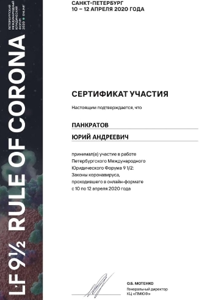
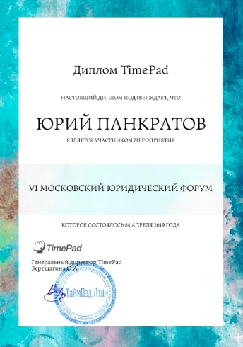
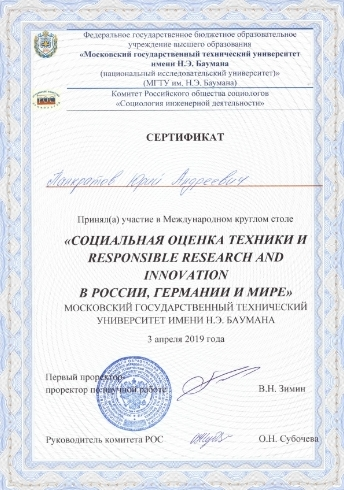
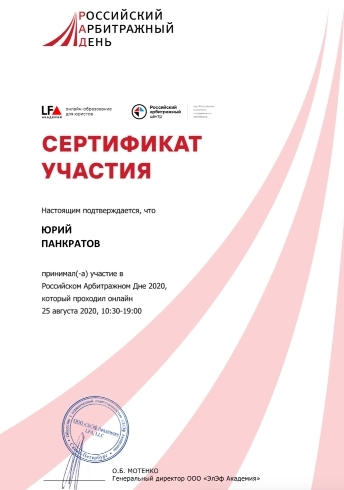
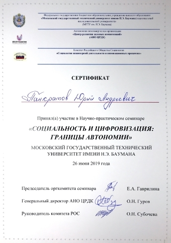
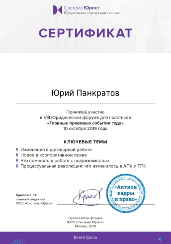
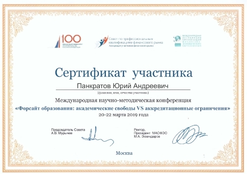
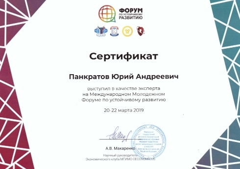

import { Cards, Steps } from 'nextra/components'

 

# Участие в общественных мероприятиях

В 2017-2020 гг. я активно участвовал в научно-просветительских мероприятиях МГТУ им. Н.Э. Баумана, МГИМО МИД России, Финансовой Академии при Правительстве России и разных компаний. Помогал в организации их проведения. Общался с докладчиками. Вот несколько подтверждений:

	

	

	

	

	

	

	

	

	

